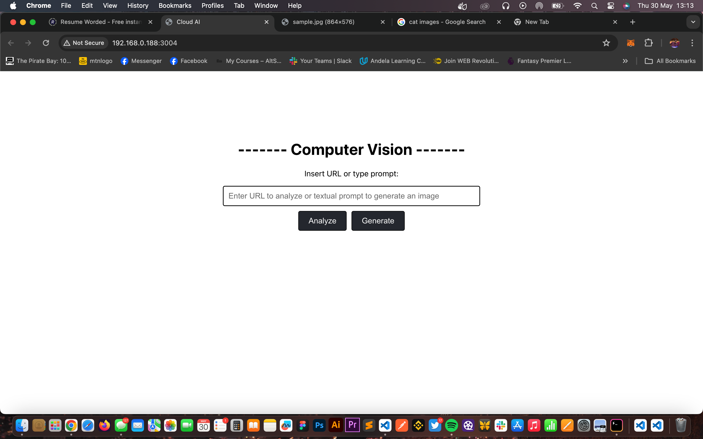
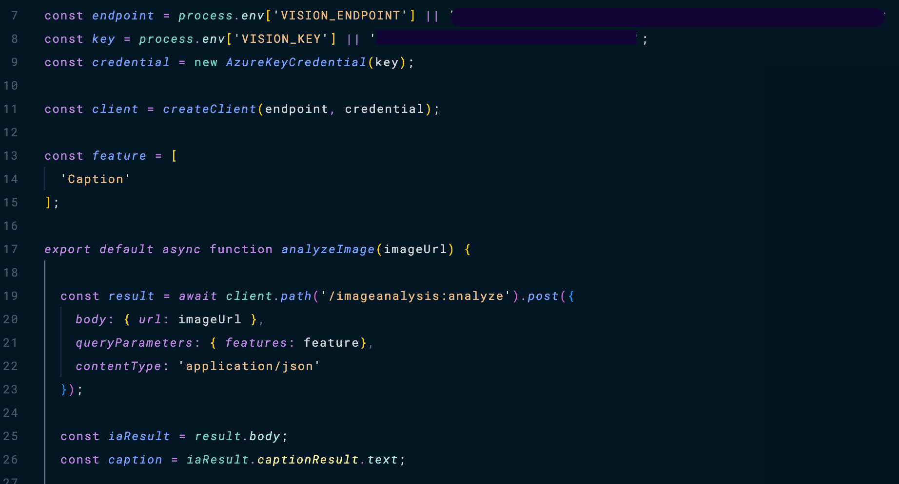

## Exploring Microsoft Azure AI Capabilities Using React, Github Actions, Azure Static Apps and Azure AI 

Lately, I've been dedicated to learning Microsoft Azure, and I've been using the Microsoft Learn platform extensively. I recently came across a challenge that requires utilizing Azure AI computer vision capabilities, specifically Azure AI Vision and Azure OpenAI cognitive services, to integrate image analysis and generation features into a product.

To complete this challenge, Microsoft Learn recommends that one should have experience using JavaScript and React or similar frameworks, experience using GitHub and Visual Studio Code and familiarity with REST APIs.

While my grasp of Javscript is quite solid and I know a little about React, I have not had any real development experience of it so my React code might look funny, bear with me. 

By the way, If this challenge sounds interesting to you and you want to attempt it, but you are not confident of your frontend development skills, do not be discouraged, as I was not. In fact, my limited knowledge was even more motivation to challenge myself. You can go through the challenge [here](https://learn.microsoft.com/en-us/training/modules/challenge-project-add-image-analysis-generation-to-app/). 
Like me, you might not get everything right, but do not hesitate to share your progress.

So, following the challenge requirements, I created a new Azure Static Web App resource and then built a CI/CD pipeline to deploy a React application on Azure, using Azure Static Web Apps service and GitHub Actions. This was my first time trying to automate a deployment pipeline and of course I struggled with this a bit. Next, I setup a react application and fixed up the GUI, spending a lot of time in the react docs and github copilot.

Up next, I had to implement the image analysis feature, after going back and forth with the documentation and some code tweaking, I arrived at this.

The code is quite straightforward, but just a little explanation:

__Line 7 - 11:__ Define useful variables. 
__Line 12 - 15:__ Creates an array that holds the query parameters for analysis feedback that is required from the Azure AI engine. here, I need just the caption for the image, but there are many more options that can be requested.
__Lines 17 - 26:__ Declares an asynchronous function. This function takes in the image URL to be analysed as an argument, and then makes a request to the Azure AI engine with the image URL, the features, and the content type. Finally, the function returns the result gotten from the API call for processing and display on my user interface.

My version of the challenge  has a fully functional Image analyses capability, but I was unable to complete the Image generation functionality because Azure OpenAI is not available in my region. To test the app, clone the repository and in the project directory run:
##### `npm start`
This will launch the react app.

The repository can be found [here](https://github.com/yutee/cloud-ai).
If you find it interesting, do not hesitate to leave a star and probably contribute to it. There are several other improvements that could be made, these inprovements can include...

- Image Generation functionality using Open AI/Azure OpenAI
- Better Security measures within the codebase
- Error handling
- Client side authentication
- User Interface micro interactions
- Add possible improvements and features to this README.

Any other ones that you can think of is welcomed, happy hacking!
